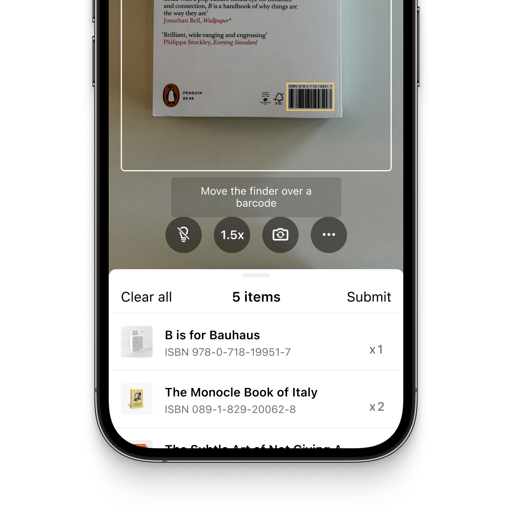
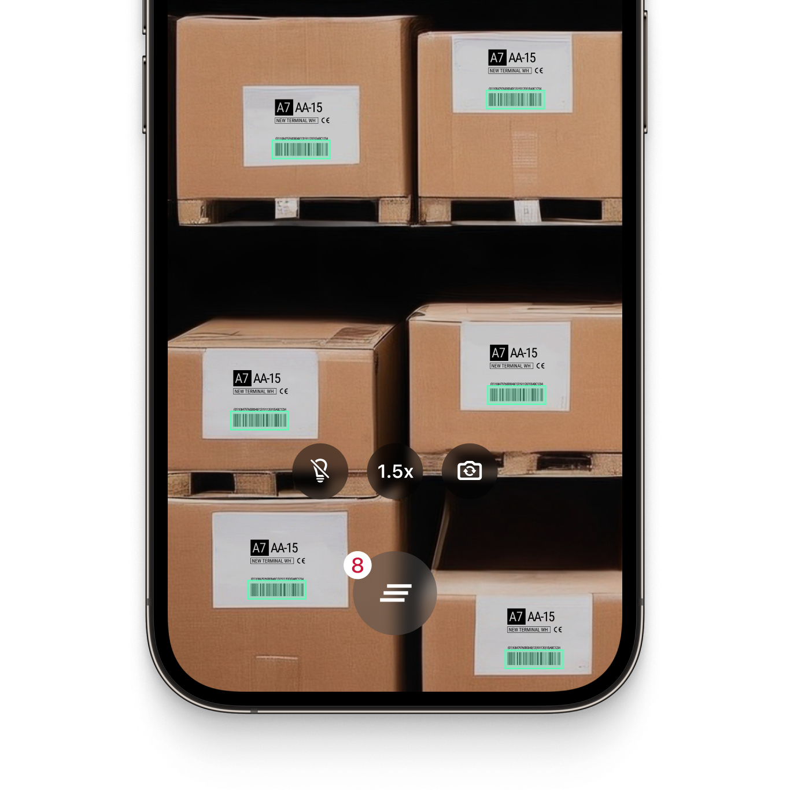

  

  

# Example App for the Scanbot iOS Barcode Scanner SDK

This example app demonstrates integrating the Scanbot iOS Barcode Scanner SDK into your native iOS apps.

## What is the Scanbot iOS Barcode Scanner SDK?

The Scanbot [Barcode Scanner SDK](https://scanbot.io/barcode-scanner-sdk/?utm_source=github.com&utm_medium=referral&utm_campaign=dev_sites) is a simple and intuitive SDK that allows you to integrate fast and accurate barcode scanning capabilities on your iOS devices.

The SDK utilizes your device's camera, which can be freely switched. You can also apply various filters to narrow down the results by barcode type or content, with regex pattern support to ensure you only capture the specific barcodes relevant to your application.

It operates entirely offline on the user's device and takes only 0.04 seconds to scan barcodes. Scans are accurate even under challenging conditions, including damaged, small, or distant barcodes and low-light environments.

The SDK can be integrated into your mobile apps within minutes and comes with Ready-To-Use UI components, which allow you to customize the barcode scanner to your needs.

💡 For more details about the Scanbot Barcode Scanner SDK, please check out our [documentation](https://docs.scanbot.io/barcode-scanner-sdk/ios/introduction/?utm_source=github.com&utm_medium=referral&utm_campaign=dev_sites).

## How to run this example app?

### Requirements

* **Operating system**: iOS 13 and higher
* **IDE**: Xcode 14.0 and higher

### Installation

Make sure you have the latest versions of [Xcode](https://developer.apple.com/xcode/) and [CocoaPods](https://cocoapods.org/) installed.

* Clone this repository to a local folder.
* run `pod install --repo-update`
* Open `ScanbotBarcodeScannerSDKDemo.xcworkspace` (not `.xcodeproj!`) with Xcode, build and run

## Features of the iOS Barcode Scanner library

### Out-of-the-box barcode scanning workflows

The Scanbot Barcode Scanner SDK offers the following scan modes, right out-of-the-box in our ready-to-use UI. Our integrated user guidance ensures users capture barcodes intuitively and reliably, even in challenging conditions.

#### Single scanning

This is the default barcode scanning mode. It is optimized for detecting a single barcode at a time and is easily configurable to your needs. You can show a confirmation screen after scanning the barcode.

#### Batch & Multi Scanning

The barcode scanner can also be configured to scan multiple barcodes in succession (without closing the scanning interface every time), to capture more than one barcode from the camera view at once, or to count the scanned items.

#### Find & Pick

Given one or more barcodes, the Barcode Scanner SDK will visually highlight and scan the correct items for your users. It automatically selects the barcode with the right barcode value from your camera feed.

|  |  |  |
| :-- | :-- | :-- |

### AR Overlay

The Scanbot Barcode Scanner SDK includes an optional AR Overlay for all scanning modes. It provides real-time barcode highlighting, preview, and tap-to-select functionalities.

Detected barcodes are highlighted with a customizable frame and text, clearly distinguishing scanned from unscanned items. Users can select barcodes manually by tapping or instead rely on automatic selection.

### Scanning barcodes from an image

The Scanbot Barcode Scanner SDK also supports still images, enabling barcode and QR Code Scanner functionality from JPG and other image files. It supports single-image and multi-image detection and returns a list with the recognized barcodes.

### Supported barcodes

The Scanbot Barcode Scanner SDK supports all common 1D- or 2D barcode formats, such as QR codes or Data Matrix codes, as well as multiple postal symbologies, including:

| Barcode type       | Barcode symbologies                                                                                                                                                                                                                                                                                                                                                                                                                                                                                                                                                                                                                                                                                                                                                                                                                                                                                                                                                                                                                                                 |
|:-------------------|:--------------------------------------------------------------------------------------------------------------------------------------------------------------------------------------------------------------------------------------------------------------------------------------------------------------------------------------------------------------------------------------------------------------------------------------------------------------------------------------------------------------------------------------------------------------------------------------------------------------------------------------------------------------------------------------------------------------------------------------------------------------------------------------------------------------------------------------------------------------------------------------------------------------------------------------------------------------------------------------------------------------------------------------------------------------------|
| 1D Barcodes        | [EAN](https://scanbot.io/barcode-scanner-sdk/ean/?utm_source=github.com&utm_medium=referral&utm_campaign=dev_sites), [UPC](https://scanbot.io/barcode-scanner-sdk/upc/?utm_source=github.com&utm_medium=referral&utm_campaign=dev_sites), [Code 128](https://scanbot.io/barcode-scanner-sdk/code-128/?utm_source=github.com&utm_medium=referral&utm_campaign=dev_sites), [GS1-128](https://scanbot.io/barcode-scanner-sdk/gs1-128/?utm_source=github.com&utm_medium=referral&utm_campaign=dev_sites), [Code 39](https://scanbot.io/barcode-scanner-sdk/code-39/?utm_source=github.com&utm_medium=referral&utm_campaign=dev_sites), [Codabar](https://scanbot.io/barcode-scanner-sdk/codabar/?utm_source=github.com&utm_medium=referral&utm_campaign=dev_sites), [ITF](https://scanbot.io/barcode-scanner-sdk/itf-code/?utm_source=github.com&utm_medium=referral&utm_campaign=dev_sites), Code 25, Code 32, Code 93, Code 11, UPC Code, MSI Plessey, Standard 2 of 5, IATA 2 of 5, Databar (RSS), GS1 Composite                                                                                                                   |
| 2D Barcodes        | [QR Code](https://scanbot.io/glossary/qr-code/?utm_source=github.com&utm_medium=referral&utm_campaign=dev_sites), Micro QR Code, [Aztec Code](https://scanbot.io/barcode-scanner-sdk/aztec-code/?utm_source=github.com&utm_medium=referral&utm_campaign=dev_sites), [PDF417 Code](https://scanbot.io/barcode-scanner-sdk/pdf417/?utm_source=github.com&utm_medium=referral&utm_campaign=dev_sites), [Data Matrix Code,](https://scanbot.io/barcode-scanner-sdk/data-matrix/?utm_source=github.com&utm_medium=referral&utm_campaign=dev_sites) [GiroCode](https://scanbot.io/glossary/giro-code/?utm_source=github.com&utm_medium=referral&utm_campaign=dev_sites), [NTIN Code](https://scanbot.io/glossary/gtin/?utm_source=github.com&utm_medium=referral&utm_campaign=dev_sites), [PPN](https://scanbot.io/glossary/ppn/?utm_source=github.com&utm_medium=referral&utm_campaign=dev_sites), [UDI](https://scanbot.io/glossary/udi/?utm_source=github.com&utm_medium=referral&utm_campaign=dev_sites), [Royal Mail Mailmark](https://scanbot.io/barcode-scanner-sdk/royal-mail/?utm_source=github.com&utm_medium=referral&utm_campaign=dev_sites), MaxiCode |
| Postal Symbologies | USPS Intelligent Mail (IMb), Royal Mail RM4SCC Barcode, Australia Post 4-State Customer Code, Japan Post 4-State Customer Code, KIX                                                                                                                                                                                                                                                                                                                                                                                                                                                                                                                                                                                                                                                                                                                                                                                                                                                                                                                                 |

💡 Please visit our [docs](https://docs.scanbot.io/barcode-scanner-sdk/ios/supported-barcodes/?utm_source=github.com&utm_medium=referral&utm_campaign=dev_sites) for a complete overview of the supported barcode symbologies.

### Data Parsers

The Scanbot Barcode Scanner SDK supports a variety of data parsers that extract structured information from 2D barcodes such as QR Codes and Data Matrix. These include parsers for documents such as driving licences (AAMVA), boarding passes, medical certificates, SEPA forms, Swiss QR codes and vCard business cards. 

💡 Please refer to our [documentation](https://docs.scanbot.io/barcode-scanner-sdk/ios/supported-barcodes/#data-parsers) for a full list of supported data parsers.

## Additional information

### Guides and Tutorials

Integrating the Scanbot Barcode Scanner SDK into your app takes just a few minutes, and our step-by-step guides make the process even easier. 

Whether you're a seasoned developer or just starting, our tutorials provide clear instructions for adding barcode scanning functionality with minimal effort.  

💡Check out our [developer blog](https://scanbot.io/techblog/?utm_source=github.com&utm_medium=referral&utm_campaign=dev_sites) for a collection of in-depth tutorials, use cases, and best practices.

### Free integration support

Need help integrating our barcode scanning software into your iOS apps? We offer [free developer support](https://docs.scanbot.io/support/?utm_source=github.com&utm_medium=referral&utm_campaign=dev_sites) via Slack, MS Teams, or email.

As a customer, you also get access to a dedicated support Slack or Microsoft Teams channel to talk directly to your Customer Success Manager and our engineers.

### Licensing and pricing

The barcode scanner example app will run one minute per session without a license. After that, all functionalities and UI components will stop working. 

To try the Barcode Scanner without the one-minute limit, you can request a free, no-strings-attached [7-day trial license](https://scanbot.io/trial/?utm_source=github.com&utm_medium=referral&utm_campaign=dev_sites).

Our pricing model is simple: Unlimited barcode scanning for a flat annual license fee, full support included. There are no tiers, usage charges, or extra fees. [Contact](https://scanbot.io/contact-sales/?utm_source=github.com&utm_medium=referral&utm_campaign=dev_sites) our team to receive your quote.

### Other supported platforms

Besides iOS, the Scanbot Barcode Scanner SDK is also available on:

* [Android (native)](https://github.com/doo/scanbot-barcode-scanner-sdk-example-android)
* [Compose Multiplatform / KMP](https://github.com/doo/scanbot-barcode-scanner-sdk-example-kmp)
* [JavaScript (web)](https://github.com/doo/scanbot-barcode-scanner-sdk-example-web)
* [React Native](https://github.com/doo/scanbot-barcode-scanner-sdk-example-react-native)
* [Flutter](https://github.com/doo/scanbot-barcode-scanner-sdk-example-flutter)
* [Capacitor & Ionic](https://github.com/doo/scanbot-barcode-scanner-sdk-example-capacitor-ionic)
* [Cordova & Ionic](https://github.com/doo/scanbot-barcode-scanner-sdk-example-cordova-ionic)
* [.NET MAUI](https://github.com/doo/scanbot-barcode-sdk-maui-example)
* [Xamarin & Xamarin.Forms](https://github.com/doo/scanbot-barcode-scanner-sdk-example-xamarin)
* [UWP](https://github.com/doo/scanbot-barcode-scanner-sdk-example-windows)
* [Linux](https://github.com/doo/scanbot-sdk-example-linux)